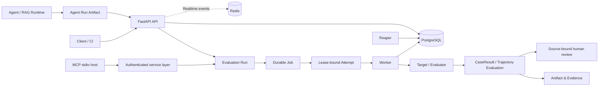

# AI EvalOps Platform

> 多租户异步 AI 评测与任务编排平台 · Agent Evaluation Infrastructure
>
> Final closeout status: `IMPLEMENTATION_COMPLETE` · `FINAL_PAIR_CONTRACT_VERIFIED` · `PORTFOLIO_READY` · `MERGED_TO_DEFAULT_MAIN` · `NOT_RELEASED`
>
> Status vocabulary: `IMPLEMENTATION_COMPLETE` · `EXACT_SHA_CI_REQUIRED` · `FINAL_PAIR_CONTRACT_REQUIRED` · `MERGED_TO_DEFAULT_MAIN` · `EXACT_MAIN_SHA_CI_VERIFIED` · `NOT_RELEASED` · `PORTFOLIO_READY` · `FORMAL_AB_NOT_RUN` · `HUMAN_REVIEW_PENDING` · `SHADOW_RELEASE_NOT_PASSED` · `PRODUCTION_NOT_VERIFIED`.

本项目把 Agent/RAG 评测从一次性脚本提升为可提交、可恢复、可审计、可复现的后台系统：PostgreSQL 管理多租户 Run/Job/Attempt 状态，Worker 使用 lease、heartbeat 与 fencing 抵御迟到写入，Reaper 恢复失联任务；Agent 轨迹通过版本化 Artifact、内外两层 SHA-256 和 Projection 校验进入 EvalOps；审计事件由持久 Outbox 和独立 Dispatcher 异步投递。

## Run the product workflow

The repository now includes a usable paired-evaluation surface, not only backend primitives.
The following command runs a frozen 120-case baseline/candidate experiment, applies the same
paired-bootstrap policy used by the formal gate, and writes a portable HTML dashboard plus
machine-readable result, arm artifacts, and SHA-256 manifest:

```powershell
./.venv/Scripts/python.exe -m scripts.run_product_experiment `
  --spec benchmarks/product_demo_v1/experiment.json `
  --output-dir artifacts/product-demo
Start-Process artifacts/product-demo/report.html
```

The demo deliberately contains known baseline misses and deterministic candidate repairs so a
reader can inspect the complete product loop without an API key or model bill. Its result is
`DEMO_PASS`, never `FORMAL_AB_COMPLETE`: it proves the runner, evaluator, statistics, identity
binding, and report—not real RAG quality uplift.

Tracked demo evidence at implementation `41de043f40c02c0d1349332c6bd19e9116202838`:
120/120 paired cases with 20 cases in each required category; baseline/candidate task success
`0.90 → 1.00`; citation correctness `0.90 → 1.00`; p95 latency `46 → 50 ms` (`+8.70%`);
mean cost `$0.010 → $0.011` (`+10%`); tool-error rate `0 → 0`. The paired task-success delta
is `+0.10` with a deterministic 95% bootstrap interval `[+0.05, +0.1583]`. These numbers are
synthetic workflow evidence only. Rehash them from
[the product manifest](docs/results/product_demo_v1/manifest.json) and inspect the
[portable report](docs/results/product_demo_v1/report.html).
The exact implementation passed [GitHub Actions 33589528112](https://github.com/godofxuan/ai-evalops-platform/actions/runs/33589528112)
before a non-force fast-forward promoted it to the default `main` branch.

To evaluate two real RAG/Agent versions, change the spec to `scope: FORMAL`, pin both exact Git
SHAs, and use two HTTPS providers whose credentials are named by `auth_env_var`. Literal secrets
and unknown configuration fields are rejected. Missing credentials produce `INPUT_REQUIRED`
before any request is sent. Formal automated success remains
`AUTOMATED_PASS_HUMAN_REVIEW_PENDING` until two real independent blinded reviews are completed.

| Product surface | Entry |
| --- | --- |
| Declarative demo spec | [experiment.json](benchmarks/product_demo_v1/experiment.json) |
| Formal policy | [policy.json](benchmarks/formal_agent_quality_v1/policy.json) |
| Product workflow tutorial | [PRODUCT_EXPERIMENT_WORKFLOW.md](docs/learning/PRODUCT_EXPERIMENT_WORKFLOW.md) |
| RAG input audit | [RAG_FORMAL_INPUT_AUDIT.md](docs/review/RAG_FORMAL_INPUT_AUDIT.md) |
| OSS design benchmark | [OPEN_SOURCE_PRODUCT_BENCHMARK.md](docs/review/OPEN_SOURCE_PRODUCT_BENCHMARK.md) |

## Final cross-repository evidence

| Evidence | Exact result |
| --- | --- |
| RAG producer | `godofxuan/Attempt-of-enterprise-rag-copilot@2065e571d77439babf76a763ac459a618950f218` |
| EvalOps consumer | `godofxuan/ai-evalops-platform@4040fa1db7cee6c8380ff8580fa21be17464435b` |
| Implementation CI | [GitHub Actions 32558950596](https://github.com/godofxuan/ai-evalops-platform/actions/runs/32558950596) — exact SHA success |
| Default `main` evidence baseline | `1c2f9d93b488cacf7d5f7c953c8cce906e0f9be6`; [GitHub Actions 33494481676](https://github.com/godofxuan/ai-evalops-platform/actions/runs/33494481676) — exact `main` SHA success |
| Final Pair Contract | 18/18 deterministic mechanism cases; 15/15 events converted; dropped 0; unmapped 0 |
| Harness envelope | `enterprise.agent-harness-envelope/1.1`; outer digest plus answer/citation/terminal/policy/error/tool projections |
| Evidence boundary | `FORMAL_AB_NOT_RUN`; `HUMAN_REVIEW_PENDING`; `SHADOW_RELEASE_NOT_PASSED`; `PRODUCTION_NOT_VERIFIED` |

Start an independent review at [FINAL_CROSS_REPO_REVIEW_ENTRY.md](docs/review/FINAL_CROSS_REPO_REVIEW_ENTRY.md). The Final Pair result proves exact-version interoperability and fail-closed mechanisms; it is not a formal quality A/B, production benchmark, or release approval.

## Executable project scorecard

The [evidence-backed scorecard](docs/review/PROJECT_SCORECARD.md) is generated from the
manifest-bound Final Pair and frozen scheduler evidence. It intentionally has no weighted
numeric total: a mechanism contract cannot compensate for missing formal quality evidence or
negative scaling. Current gate states are:

| Category | State |
| --- | --- |
| Engineering correctness | `VERIFIED_CONTROLLED` |
| Agent/RAG answer quality | `QUALITY_EVIDENCE_INSUFFICIENT` |
| Performance scalability | `NEGATIVE_SCALING` |
| Reliability | `VERIFIED_CONTROLLED` |
| Security | `EXTERNAL_VALIDATION_REQUIRED` |
| Production | `NOT_VERIFIED` |

Run `python -m scripts.project_scorecard` to rehash the inputs and verify every value. The
[scalability diagnosis](docs/review/SCALABILITY_DIAGNOSIS.md) records correlations and
unresolved hypotheses without presenting them as a root cause.

Scorecard implementation `0e66aed4d40ee33d3488605d536e6aaa4a299e78` passed exact-SHA
[GitHub Actions run 33492703967](https://github.com/godofxuan/ai-evalops-platform/actions/runs/33492703967),
including PostgreSQL/Redis/MinIO integrations and Compose observability verification.

> RAG / Agent Evaluation Infrastructure：将本地 Agent、RAG 或 LLM 评测脚本，演进为可提交、可恢复、可审计、可复现的多租户评测工作流。

[](https://github.com/godofxuan/ai-evalops-platform/actions/workflows/ci.yml?query=branch%3Amain)
[](https://www.python.org/)
[](https://fastapi.tiangolo.com/)
[](https://www.postgresql.org/)

## Why it matters

Agent evaluation is more than checking a final answer. This platform preserves the backend machinery needed to submit,
schedule, execute, recover and audit evaluation work across tenants, then adds a framework-neutral trajectory artifact
contract for tool use, terminal behavior, evidence and regression analysis.

| Focus | What is implemented |
| --- | --- |
| Async orchestration | Immutable Runs, durable Jobs and lease-bound Attempts |
| Multi-tenancy | Server-derived evidence identity, composite ownership constraints and Agent-table RLS policies |
| Concurrency safety | Lease/heartbeat/fencing, stale-worker rejection, competing Reapers and durable fair-turn state |
| Agent trajectories | Versioned framework-neutral artifact schema, canonical JSON/SHA-256 and immutable ingestion |
| Evaluation operations | Seven deterministic trajectory metric extractors with reported/derived provenance and immutable result identity |
| Regression evidence | Explicit case-set policy, fail-closed sample/coverage rules and pinned artifact/result manifest |
| Agent control plane | Official MCP SDK v2 stdio server with per-call credential revalidation through the authenticated service layer |
| Human review | Source-bound double-review/adjudication packets with selected runtime identifiers omitted and staged evaluator visibility |
| Adapter evidence | Fixed eight-family Custom/LangGraph-callback fixture replay; not a live runtime or performance benchmark |
| Evidence engineering | Source-bound artifacts, raw PostgreSQL plan assessment and manifest verification |

## System at a glance



PostgreSQL is the durable state authority. Redis carries realtime notifications. Workers use lease, heartbeat, version and
Attempt identity to fence stale writers; Reapers recover expired work.

## Engineering highlights

### Durable execution and recovery

Runs, Jobs and Attempts are deliberately separate: a Job is durable work, while an Attempt records one lease-bound
execution generation. This creates a reliable foundation for retries, recovery and audit history.

- Explicit Job state machine and bounded retry policy
- Heartbeat-based lease extension and fenced result/failure commit
- `FOR UPDATE SKIP LOCKED` Reaper recovery

### Real concurrency work, not just in-memory coordination

The scheduler and commit paths are designed around PostgreSQL transaction semantics. The project includes deterministic
RED → GREEN reproduction for a `SKIP LOCKED` false-empty race, as well as tests for stale Workers, concurrent claimers,
competing Reapers and durable tenant scheduling.

```text
lease owner + lease version + live expiry + active Attempt
                         ↓
                  fenced durable commit
```

### Reproducible evaluation evidence

Evidence tooling binds source revision, workload identity, protected correctness counters, raw PostgreSQL `EXPLAIN` output
and a SHA-256 manifest. An independent assessor rejects missing, stale or inconsistent experiment artifacts.

## Explore the project

| I want to see… | Start here |
| --- | --- |
| Current portfolio/release state | [Project status](PROJECT_STATUS.md) |
| Independent GPT review and final evidence package | [GPT review entry](docs/review/GPT_REVIEW_ENTRY.md) |
| Architecture and data flow | [Architecture](docs/01_architecture.md) |
| Agent artifact and trajectory contract | [Agent Run Artifact](docs/agent_eval/AGENT_RUN_ARTIFACT_SCHEMA.md) |
| Agent failure attribution and regression | [Failure taxonomy](docs/agent_eval/FAILURE_TAXONOMY.md) |
| Final hardening evidence and remaining gaps | [Final hardening report](docs/final_hardening/FINAL_HARDENING_REPORT.md) |
| Agent MCP control plane boundary | [MCP Eval Control Plane](docs/agent_eval/MCP_EVAL_CONTROL_PLANE.md) |
| Fixed adapter benchmark and evidence scope | [Agent benchmark](docs/agent_eval/BENCHMARK.md) |
| Run / Job / Attempt model | [Domain model](docs/02_domain_model.md) |
| Tenant boundaries | [Security boundaries](docs/08_security_boundaries.md) |
| Scheduler and concurrency tests | [Concurrency tests](tests/concurrency/) |
| Evidence tooling | [Evidence map](docs/handoffs/PROJECT_EVIDENCE_MAP.md) |
| Engineering interview stories | [Story bank](docs/handoffs/INTERVIEW_STORY_BANK.md) |
| Resume-ready project summary | [Resume package](docs/handoffs/resume_package/PROJECT_SUMMARY.md) |
| Step-by-step learning path | [Agent EvalOps tutorial](docs/learning/AGENT_EVALOPS_TUTORIAL.md) |
| Third-party origin and license review | [Provenance review](docs/handoffs/THIRD_PARTY_PROVENANCE.md) |

The current portfolio surface is `main`. Final external-harness evidence is bound to source
`ecb3c664609deca909fc8927036d1087857eacd1` and successful CI run
[`32489399266`](https://github.com/godofxuan/ai-evalops-platform/actions/runs/32489399266). The external A/B gate remains
`INPUT_BLOCKED`, and the historical scheduler evidence still blocks v0.1.0: portfolio-ready does not mean release-ready
or production-ready.

## Technology

```text
Python 3.12 · FastAPI · SQLAlchemy · psycopg · PostgreSQL · Redis · MCP Python SDK v2
pytest · Alembic · Docker Compose · Prometheus · OpenTelemetry · MinIO/S3
```

## Quick start

```powershell
uv python install 3.12
uv sync --locked --all-groups
Copy-Item .env.example .env
uv run alembic upgrade head
uv run uvicorn app.main:app --reload `
  --loop app.core.event_loop:create_psycopg_compatible_event_loop
```

```powershell
uv run pytest -q
docker compose -f deploy/compose.yaml up --build --wait
```

Run the local MCP server only after setting an existing tenant-scoped API key:

```powershell
$env:EVALOPS_MCP_API_KEY = "evk_..."
uv run python -m app.agent_eval.mcp_stdio
```

The stdio process validates the configured scrypt API key at startup and revalidates key status, expiry, tenant status
and current permissions before every tool call. It holds a PostgreSQL shared credential lock through the service call,
so revocation is ordered against in-flight calls. The environment variable can leak to child processes, same-user host
processes, shell history or diagnostics; stdio is therefore a local-host integration, not a remote multi-tenant MCP
security boundary. No MCP HTTP listener, OAuth resource server or MCP-specific rate limiter is enabled. Reproduce the
fixture adapter-contract evidence with
`uv run python -m scripts.run_agent_adapter_benchmark`.

For a fuller walkthrough, start with the [project evidence map](docs/handoffs/PROJECT_EVIDENCE_MAP.md). The complete
engineering and release record remains available in [PROJECT_STATUS.md](PROJECT_STATUS.md).

<details>
<summary><strong>Engineering deep dive and full project history</strong></summary>

## Engineering Deep Dive

## 业务问题

本项目要把只能本地运行的 RAG/Agent/大模型评测脚本，逐步改造成可提交、排队、执行、重试、恢复、取消、观察、比较和审计的后端平台。它不会复制现有 RAG 的检索或 Agent 代码；未来只通过 HTTP 把外部 RAG 当作被测目标。

第一版最终目标语义是：

```text
at-least-once job execution
+ idempotent result persistence
+ lease-based crash recovery
```

不是 exactly-once execution，也不承诺零重复或“生产级”。

## 当前实现

Phase 0 已建立：

- Python 3.12 + uv 锁文件；
- FastAPI app factory；
- JSON 结构化日志和按敏感字段名递归脱敏；
- request ID 响应头与日志上下文；
- liveness 与 readiness；
- PostgreSQL、Redis、选定 artifact backend 和 Alembic revision 探测；
- Alembic 空基线迁移；
- API、Worker、Reaper 进程骨架；
- 单元/API/真实服务集成测试合同；
- 非 root Docker 镜像、完整 Compose 拓扑和 CI 基础。

Phase 1 已建立：

- tenant 与只显示一次的 scrypt API Key；
- revoked、expired、disabled tenant 和认证并发状态复核；
- Principal 服务端派生与统一 401；
- tenant-scoped Dataset create/get；
- 有界 UTF-8 JSONL 校验与不可变 Dataset Version；
- tenant-owned artifact reference 与全局 SHA-256 content blob 分层；
- Local 与经真实 MinIO 验证的 S3-compatible artifact backend、原子发布、物理去重和摘要确认；
- Phase 1 Alembic migration、运维脚本与真实 PostgreSQL 集成测试合同。

Phase 2 已建立：

- canonical Run request hash；
- tenant-scoped Idempotency-Key replay 与 payload conflict；
- 数据库唯一约束保护的并发创建路径；
- 可复现 target/evaluator/dataset hash 与版本绑定；
- 一个 case 一个 queued Job，并保存不可变 case payload snapshot；
- `POST /api/v1/runs` 与 `GET /api/v1/runs/{run_id}`；
- Phase 2 Alembic migration 与真实 PostgreSQL 并发测试合同。

Phase 3 已建立：

- Run/Job 显式状态机和强制 reason/actor；
- 两阶段 tenant-fair claim candidate：Phase A 在独立短事务中预留 Tenant fair turn，Phase B 在
  独立短事务中用 `FOR UPDATE OF evaluation_jobs SKIP LOCKED` 领取该 Tenant 的 Job；
- 同优先级下按租户候选轮次与最久未服务时间排序；Phase B 不显式获取 Tenant scheduler row lock，
  但 tenant-referencing durable writes 仍受 PostgreSQL foreign-key lock semantics 约束；
- Phase B 在一个 durable transaction 内原子更新状态、lease、version、Attempt、审计与 Outbox；
- result completion 先用 `FOR NO KEY UPDATE` 串行化同一 Run writer，再锁 owned Job；该 Run guard 与
  claim/Outbox 外键的 `KEY SHARE` 兼容，避免 Run→Job / Job→Run 锁环；
- owner/version/live-expiry 保护的心跳条件更新；
- 10 Worker 真实 PostgreSQL 并发测试合同。

Phase 4 已建立：

- deterministic MockTarget，以及由操作员 Registry 管理、固定公网 IP 连接并校验实际 peer 的
  HTTPRAGTarget；
- 单一注册源的 evaluator registry：明确标为 lexical 的 BasicAnswerEvaluator、
  RetrievalCitationEvaluator，以及归类为 operational 的 ExecutionEvaluator；
- Worker 的 claim → Target → Evaluator → result 成功流水线；
- lease owner/version/expiry fencing 的 CaseResult 提交；
- Job/Attempt/Result/Audit/Run counter 同事务更新。

Phase 5 已建立：

- transient/permanent/cancelled 失败分类与有界指数退避；
- 执行 Target 期间的周期 heartbeat 与 cooperative cancellation；
- lease-fenced 失败提交和 Reaper 过期租约回收；
- queued/retry_wait 直接取消、running 转 cancelling 的幂等取消 API；
- 基于数据库真实 Job 状态重算的 Run counter/status 聚合；
- 可直接运行的 Worker/Reaper CLI 循环。

Phase 6 已建立：

- tenant/run scoped Redis Pub/Sub 实时事件；
- 鉴权后先读取 PostgreSQL snapshot 的 SSE；
- heartbeat、跨 tenant 消息复核与客户端断开清理；
- Redis publish 故障不影响 Worker durable path；
- Redis subscriber 故障转 PostgreSQL polling。

Phase 7 已建立：

- tenant-scoped keyset cursor case 查询、筛选和 metric 排序；
- 明确定义分母和 percentile 算法的聚合指标；
- RunMetric 持久化与 Run GET 指标摘要；
- metrics、failure cases、summary report JSON artifact；
- 同 Dataset Version 比较与跨版本 intersection warning/diff。

Phase 8 已建立：

- 默认关闭、服务端派生的 human reviewer credential 权限；
- deterministic sample 与不含 machine metric 的 blind packet；
- 两个不同 reviewer 的 immutable submission；
- Task row lock 保护的 agreed/disputed 转换；
- 第三 reviewer adjudication；
- agreement、Cohen’s kappa 与 human review packet artifact。

Phase 9 已建立：

- API/Worker/Reaper 独立 Prometheus registry 与低基数指标；
- API `/metrics`、Worker 9101、Reaper 9102 抓取入口；
- 经真实 Compose 验证的 Prometheus 与 OpenTelemetry Collector 数据路径和 fail-closed 脚本；
- API request、Run 创建、claim、Target、Evaluator、result、Reaper、SSE 业务 span；
- W3C `traceparent` API 延续、Run 来源 carrier 持久化，以及 Worker/Reaper 异步 Span Link；
- question/answer/evidence/credential 等敏感字段脱敏；
- Redis/数据库单轮故障、SSE 断连和观测资源生命周期回归；
- 20 个并发幂等请求、10 Worker/100 Jobs、2 Reaper 的真实 PostgreSQL 测试合同；
- 500-case 1/2/4/8 Worker、故障注入、幂等并发和 Run diff 实验脚本；
- 架构图、面试问题和不夸大证据的简历材料。

## 架构骨架

```text
Client
  |
  v
FastAPI API
     |
     +---- Bearer API Key ---- tenant Principal
     |                              |
     |                              +---- Dataset / immutable version ---- PostgreSQL
     |                                                       |
     |                                                       +---- artifact metadata
     |                                                               |
     |                                                               +---- SHA-256 Local / S3-compatible storage
     |
     +---- readiness ---- PostgreSQL / Redis / selected artifact backend / Alembic
     +---- structured JSON logs + request_id + tenant context

Worker ---- claim → heartbeat → Target → Evaluator → fenced result/failure
Reaper ---- expired lease → retry_wait / failed / cancelled
```

PostgreSQL 是领域状态的最终事实来源。Redis 只承担可丢失的实时通知，不能决定最终
Run/Job 结果。SSE 重连首先读取 PostgreSQL，而不是假设 Pub/Sub 可以回放。

更详细的阶段边界见 [项目范围](docs/00_project_scope.md)、[架构说明](docs/01_architecture.md)、
[完整架构图](docs/architecture_diagram.md)、[Phase 1 领域模型](docs/02_domain_model.md)和
[安全边界](docs/08_security_boundaries.md)。

## 快速启动

### 本地 Python

前置条件：uv 和 Python 3.12。uv 可以自动安装缺失的 Python 3.12。

```bash
uv python install 3.12
uv sync --locked --all-groups
cp .env.example .env
uv run alembic upgrade head
uv run uvicorn app.main:app --reload \
  --loop app.core.event_loop:create_psycopg_compatible_event_loop
```

上述 Alembic 和 readiness 命令要求 `.env` 指向真实 PostgreSQL/Redis。只访问 liveness 不会主动连接外部服务：

Uvicorn 显式使用项目的 Selector loop factory，是因为 psycopg async 在 Windows 不兼容系统默认的 Proactor loop。Alembic、CLI、运维脚本和 async pytest 也使用同一合同，避免“测试能跑、真实入口不能连接”的差异。

```bash
curl http://127.0.0.1:8000/health/live
```

预期：

```json
{"status":"alive"}
```

创建开发 tenant/API Key（明文只在成功提交后显示一次）：

```bash
uv run python -m scripts.create_dev_api_key \
  --tenant-slug demo \
  --tenant-name "Demo tenant" \
  --key-name local
```

Human Review Task creator 与 reviewer 是两个默认关闭的独立权限。建议分别创建 credential：

```bash
uv run python -m scripts.create_dev_api_key \
  --tenant-slug demo \
  --key-name review-operator \
  --review-task-creator

uv run python -m scripts.create_dev_api_key \
  --tenant-slug demo \
  --key-name reviewer-a \
  --human-reviewer
```

撤销时只传安全前缀，不要把完整密钥放入命令历史：

```bash
uv run python -m scripts.revoke_api_key evk_001122334455
```

用返回的密钥创建 dataset 并上传 version：

```bash
curl -X POST http://127.0.0.1:8000/api/v1/datasets \
  -H "Authorization: Bearer $EVALOPS_DEMO_API_KEY" \
  -H "Content-Type: application/json" \
  -d '{"name":"rag-regression","description":"Regression cases"}'

curl -X POST http://127.0.0.1:8000/api/v1/datasets/<dataset-id>/versions \
  -H "Authorization: Bearer $EVALOPS_DEMO_API_KEY" \
  -F "file=@cases.jsonl;type=application/x-ndjson"
```

不要把真实 API Key 写入 `.env.example`、源码、日志或 shell 脚本。上面的环境变量名只是调用示例。

### Docker Compose

```bash
docker compose -f deploy/compose.yaml up --build --wait
curl http://127.0.0.1:8000/health/ready
```

Compose 会启动 PostgreSQL、Redis、MinIO、Prometheus、OpenTelemetry Collector、一次性
migration、API、Worker 和 Reaper。默认开发端口只绑定到 `127.0.0.1`。

九个服务都显式使用非 root 用户、只读镜像根文件系统、`cap_drop: ALL` 与
`no-new-privileges`，并设置 CPU、内存和 PID 上限。需要写入的目录只通过命名 volume 或有界
tmpfs 开放：PostgreSQL/Redis/MinIO 写各自数据卷，API/Worker 保留 Local backend 的 artifact
卷；migrate/Reaper 不挂载 artifact 卷。CI 还会用 `docker inspect` 验证 Docker 的有效
HostConfig，而不只解析 YAML。

默认 limit 是开发/CI containment，不是生产容量结论。可通过 `.env.example` 中的
`EVALOPS_APP_*`、`EVALOPS_POSTGRES_*`、`EVALOPS_REDIS_*` 和 `EVALOPS_MINIO_*` 调整；修改前应使用真实负载观察
OOM、CPU throttling、PID 和尾延迟。升级基础镜像或改用 host bind mount 后必须重跑 fresh-volume
Compose smoke，并确认宿主目录 ownership。

停止并删除开发数据卷：

```bash
docker compose -f deploy/compose.yaml down --volumes
```

这会删除 Compose 管理的开发数据库、Redis、MinIO object 和 Local artifact 卷，不应在需要保留这些开发数据时执行。

## 健康检查合同

`GET /health/live`

- 只证明 API 进程可响应；
- 不访问 PostgreSQL、Redis 或文件系统；
- 返回 HTTP 200。

`GET /health/ready`

- 并发检查 PostgreSQL `SELECT 1`；
- 检查 Redis `PING`；
- Local backend 执行临时写入、flush、`fsync` 和清理；S3 backend 执行无写入的 bucket 探测；
- 比较数据库 current revisions 与代码 Alembic heads；
- 全部正常返回 200；
- 任一失败返回 503 和稳定错误码；
- 不回显底层异常、连接串或密码。

## 配置

所有配置使用 `EVALOPS_` 前缀。示例见 `.env.example`。

数据库、Redis URL 和 OTLP headers 使用 Pydantic `SecretStr`。日志处理器还会对
`api_key`、`authorization`、`database_url`、`redis_url`、`password`、`secret`、
`token`、`question`、`expected_answer`、`answer`、`response`、`evidence`、`trace`
等字段递归脱敏。脱敏依赖正确字段命名，不能识别被错误放入普通文本字段的任意秘密。

Dataset 默认限制为 10 MiB 文件、10,000 个 case、1 MiB 单行，可分别通过 `EVALOPS_DATASET_MAX_FILE_BYTES`、`EVALOPS_DATASET_MAX_CASES` 和 `EVALOPS_DATASET_MAX_LINE_BYTES` 下调或在受控范围内调整。

### HTTP Target Registry

HTTP Target 不是由 tenant 自由提交 URL。操作员通过
`EVALOPS_HTTP_TARGET_REGISTRY` 维护版本化 Registry，例如在 `.env` 中写入：

```dotenv
EVALOPS_HTTP_TARGET_REGISTRY={"rag-production":{"version":"rag-v1","config":{"base_url":"https://rag.example.com","endpoint":"/v1/query","auth_env_var":"RAG_PRODUCTION_BEARER_TOKEN"}}}
```

tenant 创建 Run 时只提交 Registry ID，并让请求版本与 Registry 版本精确一致：

```json
{
  "target": {
    "type": "http_rag",
    "version": "rag-v1",
    "config": {"target_id": "rag-production"}
  }
}
```

Registry 不接受 `target_id`、`allowed_hosts`、重定向开关或明文认证值；平台从
`base_url` 派生精确 hostname，并把经过验证的执行配置冻结到 Run。Registry 中只保存
`auth_env_var` 名称，真实 token 必须通过部署系统单独注入 Worker 进程；不要把 token 放进
Registry JSON、源码、镜像或日志。除纯凭证轮换外，操作员修改执行配置时必须同步提升
Registry version；平台会保存配置 hash，但无法替操作员推断版本命名是否诚实。

HTTP Target 仅允许 HTTPS 443、无 userinfo/query/fragment 的 base URL 和无 authority 的绝对
endpoint；不跟随重定向。hostname 必须是 ASCII，IDN 由 operator 显式写成规范化 punycode。
每次执行会解析全部 A/AAAA 地址，只接受原生公网地址，选择其中一个
数值 IP 建连，同时保留原 hostname 的 Host 与 TLS SNI，并在读取正文前核对实际 peer。生产部署
仍必须叠加网络 egress policy；这套应用层边界不能被描述为“完全消除 SSRF”。内部测试目标使用
MockTarget，不要把私网服务加入 HTTP Registry。

## 指标、Trace 与实验

```bash
curl http://127.0.0.1:8000/metrics
```

Prometheus 指标不使用 tenant/run/job/attempt ID 标签；这些高基数字段只进入日志和 trace。
API 抓取会从 PostgreSQL 刷新 queue/running/heartbeat Gauge。Worker/Reaper 分别在
Compose 内部端口 9101/9102 暴露自己的 counter/histogram。

配置 `EVALOPS_OTEL_EXPORTER_OTLP_ENDPOINT` 后，API、Worker 和 Reaper 使用 OTLP/HTTP
向 Collector 导出 span。未配置 endpoint 时仍生成本进程 trace ID，但没有后端持久化，
不能声称已经具备生产 trace 查询。

可复现实验：

```bash
uv run python -m scripts.run_concurrency_test
uv run python -m scripts.run_load_test
uv run python -m scripts.run_comparison_experiment
uv run python -m scripts.run_failure_scenarios --allow-service-disruption
```

Gate 1 prepared manifest schema v6 会冻结 result schema v4、expected arm plan 和不可弱化的
quality policy。Docker stats 通过完整容器 ID 绑定 Compose service；同一快照内只求和全部 Worker
副本，再计算集群 CPU/RSS 的 p50/p95/p99/peak。缺副本为 `UNKNOWN`，重复或无效样本为
`FAILED`，都不能参与容量比较。最终 aggregate 自动将客观质量标为 `VERIFIED`、`FAILED` 或
`UNKNOWN`；只有完整有效时才标记 `READY_FOR_HUMAN_REVIEW`。adoption 始终由人决定，工具不会
自动选择或修改 Worker 数。`--confirm-quality-gate` / `--confirm-adoption-gate` 只是授权开始正式
运行，不能代替结果检查或用户拥有的性能阈值。

实验密钥从 `EVALOPS_EXPERIMENT_API_KEY` 读取。failure 脚本会 stop/kill 开发 Compose
服务，只能在独占开发环境执行。结果默认写入 `docs/results/` 且拒绝覆盖。完整合同见
[可观测性与实验](docs/12_observability_and_experiments.md)和
[故障矩阵](docs/13_failure_injection_matrix.md)。

## 测试与质量命令

```bash
uv lock --check
uv run ruff format --check .
uv run ruff check .
uv run mypy app
uv run mypy scripts
uv run pytest -m "not integration"
```

真实服务集成测试：

```bash
EVALOPS_RUN_INTEGRATION=1 uv run pytest -m integration
```

在 PowerShell 中：

```powershell
$env:EVALOPS_RUN_INTEGRATION = "1"
uv run pytest -m integration
```

集成测试禁止用 SQLite 代替 PostgreSQL。CI 会启动真实 PostgreSQL 和 Redis、执行 migration 后再运行它。

## 数据模型与状态机

Phase 1 migration 最初创建五张领域表：

- `tenants`；
- `api_keys`（只含 prefix 与 scrypt hash，不含明文）；
- `datasets`；
- `artifacts`（当时的一体化 tenant/物理元数据，已由 P1-7 migration 迁移）；
- `dataset_versions`（`dataset_id + version` 和 `dataset_id + sha256` 唯一）。

Phase 2 migration 新增：

- `evaluation_runs`（`tenant_id + idempotency_key` 唯一）；
- `evaluation_jobs`（`run_id + case_id` 唯一，保存不可变 case payload snapshot）。

Phase 3 migration 新增：

- `job_attempts`（`job_id + attempt_number` 唯一）；
- `audit_events`（tenant-owned 状态转换审计）。

Phase 4 migration 新增：

- `evaluation_runs.evaluator_type`；
- `case_results`（Job 唯一且 Run/case 唯一）。

Phase 7 migration 新增：

- `artifacts.run_id` 与报告类型；
- `run_metrics`（`run_id + metric_name` 唯一）。

Phase 8 migration 新增：

- `api_keys.can_review`（默认 false）；
- `human_review_tasks`；
- `human_review_submissions`；
- `human_review_adjudications`。

P1-7 migration `20260802_0009`：

- 用 `artifact_blobs` 保存全局 SHA-256、大小和物理相对路径；
- 用 `artifact_references` 保存 reference UUID、tenant、可选 Run、artifact type 和 media type；
- 保留旧 Artifact UUID，并把 `dataset_versions.artifact_id` 无损切到 reference；
- 同 tenant 的不同 Run 和不同 tenant 都可以分别拥有同一 blob，授权不再由物理去重键决定。

P2-1 migration `20260802_0010`：

- 给 `dataset_versions` 增加由 Dataset 派生的非空 `tenant_id`；
- 用包含 tenant 的复合外键约束 Dataset、Artifact Reference、Dataset Version、Run、
  API Key 与人工复核记录必须属于同一租户；
- 用 `(job_id, run_id)` 复合外键约束 Case Result 和 Human Review Task 必须引用同一条
  Job/Run 父链；
- upgrade 在加约束前检查历史矛盾并失败关闭，不会擅自改写归属；downgrade 恢复旧单列
  外键并移除可派生的 Dataset Version tenant 列。

P2-2 migration `20260802_0011`：

- 新增默认 false 的 `api_keys.can_create_review_tasks`；
- 普通 key 和 reviewer-only key 都不能创建/扩展 Human Review Task；
- creator-only key 可以创建 Task，但不会因此获得 list/submit/adjudicate reviewer 权限；
- 权限只从数据库认证记录进入 Principal，请求 body/query/header 不能自我提权。

P2-3 migration `20260802_0012`：

- `evaluation_runs.origin_traceparent` 保存首次创建 Run 的平台 `run.create` span carrier；
- 每次 Worker attempt 保持独立 root trace，通过 Span Link 指向 Run 创建 span；
- Reaper batch 保持独立，每个 recovered Job 产生自己的 linked root span；
- 历史 Run、禁用 telemetry 和 malformed carrier 安全退化为无 Link，不影响业务状态；
- 只保存 W3C `traceparent`，不持久化 baggage、tracestate、凭据或请求内容。

所有已实现的 dataset/version 和 artifact reference 读取先过滤服务端 tenant 与资源 ID，再
解析 blob。跨表复合外键提供数据库纵深防御；四张核心评测表已启用最小 PostgreSQL RLS
spike，并由非 owner、非 `BYPASSRLS` 角色的真实 PostgreSQL 集成测试验证。当前应用仍使用
共享 owner 凭据，因此这不是生产强制边界；两者不是同一种隔离机制。

Run/Job 状态转换由两个纯领域状态机集中校验，图和审计规则见
[状态机合同](docs/03_state_machines.md)。

实时事件和故障降级合同见 [SSE 合同](docs/07_realtime_events.md)。
结果、指标和比较语义见 [结果分析合同](docs/10_results_metrics_and_comparison.md)。
人工评审信任和盲化边界见 [人工评审合同](docs/11_human_review.md)。

## Worker、崩溃恢复与幂等

- Worker CLI 已运行 claim、执行期 heartbeat、Target、Evaluator 与 fenced commit 循环；
- Reaper 使用 `SKIP LOCKED` 小批量扫描并回收过期 lease；
- Job/Run 状态与 progress notification intent 在同一 PostgreSQL 事务写入 Outbox；
- API relay 使用短租约、`SKIP LOCKED`、fenced acknowledgement 与有界退避发布 Redis；
- transient failure 使用带 jitter 的有界指数退避，permanent failure 不重试；
- cooperative cancellation 由 heartbeat 观察，陈旧 Worker 不能提交结果或失败；
- Run 创建已使用 canonical request hash、Idempotency-Key 和 PostgreSQL 唯一约束；
- 相同 key/请求返回同一 Run，不同请求返回 409；
- 真实 PostgreSQL 并发合同存在，但本机因无数据库而 skipped。

本机无 PostgreSQL/Redis，所以真实行锁和 Outbox integration 在本地仍明确 skipped；GitHub
Actions #28 已验证双 Reaper 并发、双 relay 认领、失败重试和 publish-before-ack 重放。这里的
事件交付是 at-least-once，同一 `event_id` 可重复；它不证明 exactly-once 或 Pub/Sub 历史回放。

## 实验结果

Phase 0–9 的本地命令、RED/GREEN 证据和环境限制分别记录在
[Phase 0 日志](docs/phase_0_execution_log.md)、[Phase 1 日志](docs/phase_1_execution_log.md)、
[Phase 2 日志](docs/phase_2_execution_log.md)和
[Phase 3 日志](docs/phase_3_execution_log.md)和
[Phase 4 日志](docs/phase_4_execution_log.md)和
[Phase 5 日志](docs/phase_5_execution_log.md)和
[Phase 6 日志](docs/phase_6_execution_log.md)和
[Phase 7 日志](docs/phase_7_execution_log.md)和
[Phase 8 日志](docs/phase_8_execution_log.md)和
[Phase 9 日志](docs/phase_9_execution_log.md)。幂等细节见
[Run 幂等合同](docs/04_idempotency_contract.md)，领取细节见
[Worker 租约合同](docs/05_worker_lease_contract.md)，阶段汇总见
[工程日志](docs/engineering_journal.md)。
Target 与自动指标边界见 [评测语义](docs/09_evaluation_semantics.md)。
重试、回收和取消语义见 [恢复合同](docs/06_retry_and_cancellation.md)。

P1-6 operator Registry、DNS rebinding 与实际 peer 加固的逐条判断、RED/GREEN、环境问题和
残余风险见 [HTTP Target 安全加固记录](docs/reviews/p1_6_http_target_security_log.md)。
Gate 1 自动质量检查、人工采纳边界、schema 升级和旧证据影响见
[P2-5 Gate 自动化记录](docs/reviews/p2_5_gate_automation_log.md)。
Worker 集群资源按快照聚合、Compose 身份绑定、RED/GREEN、工具超时和 schema v6/v4 影响见
[P2-6 Worker 集群资源记录](docs/reviews/p2_6_worker_cluster_resources_log.md)。
状态/通知双写窗口、Outbox migration、relay 租约与退避、真实 CI 死锁及锁顺序修复见
[P2-7 事务型 Outbox 记录](docs/reviews/p2_7_transactional_outbox_log.md)。
delivered retention、durable backlog 指标、告警模板、Compose 转发与真实并发 cleanup 见
[P2-8 Outbox 运维记录](docs/reviews/p2_8_outbox_operations_log.md)。
durable Gauge 成功时间、刷新失败计数、失败降级与 stale alert 见
[P2-9 Outbox 指标新鲜度记录](docs/reviews/p2_9_outbox_metrics_freshness_log.md)。

不得把跳过的集成测试或未运行的 Docker 命令写成通过。

2026-07-29 Phase 8 本机阶段结果：

| 检查 | 结果 |
|---|---|
| Python / uv | CPython 3.12.13 / uv 0.11.32 |
| lock | `uv lock --check` 通过 |
| format / lint | Phase 8 文件已格式化；All checks passed |
| mypy | app 86 files，无问题 |
| pytest 非集成 | 210 passed，6 deselected |
| Phase 8 PostgreSQL review contract | 1 skipped；本机未启用 migrated PostgreSQL |
| Alembic | 唯一 head `20260729_0007`；offline PostgreSQL SQL 通过 |
| Compose YAML / CI YAML | PyYAML 静态解析通过 |
| Docker build / Compose up | 未运行；`docker --version` 与 `docker compose version` 均为 CommandNotFound |
| GitHub Actions | 未运行；没有 push |

2026-07-29 Phase 9 当前验证结果（本机 + GitHub CI）：

| 检查 | 结果 |
|---|---|
| Python / uv | CPython 3.12.13 / uv 0.11.32 |
| observability deps | OpenTelemetry SDK 1.44.0 / Prometheus Client 0.26.0 |
| lock | `uv lock --check` 通过；60 packages |
| format / lint | 199 files already formatted；All checks passed |
| mypy | app + scripts + integration/concurrency tests，103 source files，无问题 |
| pytest 非集成 | 235 passed，6 deselected |
| 真实 PostgreSQL/Redis contracts | 本机 6 skipped；GitHub Actions 6 passed |
| Alembic | 唯一 head `20260729_0008`；offline SQL 与 CI 真实 PostgreSQL migration 通过 |
| Docker image / Compose smoke | 本机无 Docker；GitHub Actions build、迁移、API/Worker/Reaper 启动和 readiness 通过 |
| 500-case / 1/2/4/8 Worker | NOT-RUN；Docker/Compose 均为 CommandNotFound |
| fault/container comparison 实验 | NOT-RUN；没有运行栈 |
| GitHub Actions | [Run #7](https://github.com/godofxuan/ai-evalops-platform/actions/runs/30425559361) 两个 job 均通过 |

未执行实验的完整清单见
[Phase 9 环境与阻塞](docs/results/phase_9_environment_and_blockers.md)。本 README 不提供
吞吐/p50/p95 数字，因为本机没有产生这些证据。

2026-08-02 P2-7 事务型 Outbox 验证结果：

| 检查 | 结果 |
|---|---|
| lock / format / lint | 70 packages；259 Python files；All checks passed |
| strict mypy | app + scripts + integration/concurrency，119 source files |
| 最终 pytest 非集成 | 488 passed，9 deselected |
| 本机 Outbox integration | 1 skipped；本机未启用真实 PostgreSQL/Redis |
| Alembic | 唯一 head `20260802_0013`；远端 downgrade/re-upgrade 通过 |
| GitHub Actions #27 | Outbox step 通过，但旧双 Reaper 场景发现并发死锁；整体 failure |
| GitHub Actions #28 | 锁顺序修复后两个 job success；Outbox/并发/image/Compose 全部执行 |
| GitHub Actions #29 | 最终 P2-7 head `5092f49` 两个 job success；tracing 与文档也纳入验证 |
| 正式 500-case/32-arm | NOT_RUN |

2026-08-03 P2-8 Outbox retention 与运维可观测性验证结果：

| 检查 | 结果 |
|---|---|
| lock / format / lint | 70 packages；260 Python files；All checks passed |
| strict mypy | app + scripts + integration/concurrency，119 source files |
| 最终 pytest 非集成 | 504 passed，9 deselected |
| 本机 Outbox integration | 1 skipped；本机未启用真实 PostgreSQL/Redis |
| Alembic | 唯一 head `20260803_0014`；offline 与远端 downgrade/re-upgrade 通过 |
| GitHub Actions #31 | 实现 head `69cba41` 两个 job success；真实 retention/metrics/migration/Compose 通过 |
| GitHub Actions #32 | 代码与首版证据文档 head `5b374d2` 两个 job success；确认文档提交未破坏同一完整流水线 |
| Prometheus alert rules | YAML/表达式合同通过；真实 Prometheus/Alertmanager `NOT_RUN` |
| 正式 500-case/32-arm | NOT_RUN |

2026-08-03 P2-9 Outbox 指标刷新新鲜度验证结果：

| 检查 | 结果 |
|---|---|
| lock / format / lint | 70 packages；261 Python files；All checks passed |
| strict mypy | app + scripts + integration/concurrency，119 source files |
| 最终 pytest 非集成 | 508 passed，9 deselected，241.85 秒 |
| 本机 Outbox integration | 1 skipped；本机未启用真实 PostgreSQL/Redis |
| GitHub Actions #34 | 代码/测试 head `30d4d37` 两个 job success；真实 PG/Redis、migration、image、Compose 通过 |
| GitHub Actions #35 | 代码、CI 命名与首版证据文档 head `074570c` 两个 job success |
| 新指标 | last-success timestamp Gauge + refresh-failure Counter；均无 ID label |
| stale alert | YAML/表达式合同通过；真实 Prometheus/Alertmanager `NOT_RUN` |
| 正式 500-case/32-arm | NOT_RUN |

## v0.1.0 Release Candidate 证据结论

当前决定：**`NOT_READY_TARGETED_NEGATIVE_SCALING`，不得发布 v0.1.0 tag/Release**。唯一授权的 Candidate 3
已完成 durable fair-round redesign；schema-v2 qualification source `91acdba` 的普通 PostgreSQL CI
`31351821014`/`31351825433` 均通过。source-bound targeted run `31352270523` 完成了全部四次 repetitions，
但正式 repeated assessment 返回 `NEGATIVE_SCALING`。完整判定见
[v0.1.0 Release Decision](docs/release/v0.1.0/RELEASE_DECISION.md)。

四个 schema-v2 rep bundles 均为 `VERIFIED`：64/64 arms、6,400/6,400 terminal Jobs、所有 protected
correctness counters 为 0；每次 20:1 的 w1/w2/w4/w8 secondary position 都是 `2/2/2/2`。证据合同问题
已经关闭，当前真实 blocker 是 4→8 Worker scaling：single `0.782511`、balanced `0.772797`、20:1
`0.796214` 均低于冻结下限 `0.95`，只有 many-small `1.014063` 通过。按 `targeted fail -> STOP`，不做
Candidate 4，也不运行当前 capacity、A/B/C same-runner、A–I fault 或 formal 32-arm。

本轮进一步加固了证据边界：schema-v2 assessor 现在从保存的 raw PostgreSQL plan 独立重算
selector-specific candidate cardinality，targeted assessor 从 arm ID 独立绑定 workload metadata 和数值
domain，`empty_while_eligible` 也成为自动 release blocker。真实 PostgreSQL 并发测试还复现并修复了
“eligible Job 暂时被 `SKIP LOCKED` 跳过时误把 Tenant permit 标成 `EMPTY`”的边界。

预注册性能归因 workflow `31400658653` 在正式归因前停止：三次 OFF/ON 的吞吐中位数变化
`+3.5404%`，但 claim-p95 中位数绝对变化 `11.3194%`，超过冻结的 `10%` 扰动预算，因此结论是
`INSTRUMENTATION_TOO_INTRUSIVE`。正式 H1/H2/H3 repetitions 未运行，三个假设均为 `INCONCLUSIVE`；
这份诊断不能改变 `31352270523` 的 `NEGATIVE_SCALING` 或授权 Candidate 4。

随后授权的低开销 requalification 先冻结新合同，再减少无效 clock reads、增加 exact-arm runner，并将
3 OFF/3 ON 顺序改为 `off1/on1/on2/off2/off3/on3`。workflow `31407782154` 的 throughput 中位数只变化
`+0.5446%`，但 claim-p95 仍变化 `-13.4906%`，再次超过同一个 10% 绝对预算。因此第二次 verdict 仍为
`INSTRUMENTATION_TOO_INTRUSIVE`；formal attribution 继续 skipped，H1/H2/H3 继续 `INCONCLUSIVE`。按第二次
预注册，不再自动设计第三种 observer。

在后续单独授权并预注册的最终 passive measurement qualification 中，workflow `31421039618` 使用外部
PostgreSQL 5 Hz sampling 和固定的 `OFF/ON/ON/OFF`、`ON/OFF/OFF/ON` 区组顺序。throughput 中位数从
`29.918848` 变为 `29.790450`（`-0.4292%`，在 5% 预算内），但 claim-p95 从 `708.689593 ms` 变为
`509.975702 ms`（`-28.0396%`，绝对值超过 10% 预算）。即使 ON 更快，也说明 measurement mode 与被测
结果不可忽略地相关，因此 verdict 是 `MEASUREMENT_SYSTEM_INVALID`，不是性能改善。正式 H1/H2/H3 仍未运行；
最终归因状态为 `PERFORMANCE_ATTRIBUTION_STOPPED_BY_MEASUREMENT_VALIDITY`，measurement candidate budget 为 0。

最终 source-bound 证据：

- fair capacity source `9987a28` / run `31272789199`：1k/10k 为 32/32、100k 为 16/16，全部
  `VERIFIED`；Jobs/s 中位数分别为 43.240、22.501、3.377；
- formal load source `6acf72c` / run `31274490704`：32/32 arms、16,000 jobs、correctness failure 0；
- fault source `70a9b2b` / run `31275450353`：A–I ×3 共 27/27，stale success/failure accepted 0。

上述 capacity/formal/fault 数字全部是 `VERIFIED_HISTORICAL`，不是 Candidate 3 的当前结果，也不是
生产 SLO。Candidate 3 的 current evidence chain、停止原因和 `NOT_RUN` disposition 见
[fairness redesign 文档](docs/release/v0.1.0/fairness_redesign/11_FINAL_DECISION.md)。

## 当前限制

- PostgreSQL RLS spike 已验证非 owner 角色的纵深隔离，但当前共享 owner 运行凭据会绕过
  策略，生产落地仍需拆分 migration/runtime role 并接入事务级 tenant context；
- API Key 认证尚无限流/容量验证，不声称抵御 DoS；
- Local artifact storage 仍不适合多 API 主机共享；S3-compatible backend 已经真实 MinIO
  集成与 Compose readiness 验证，但数据库提交与对象删除仍不是跨系统原子事务；
- JSONL 第一版有界读入内存，不是流式 parser；
- Run API 已有 create/get/cancel/SSE/cases/metrics/artifacts/compare；
- Worker/Reaper 已有 bounded exponential reconnect backoff、恢复后重置和 stop-aware wait，
  并通过三次 3 秒 PostgreSQL outage 的 A–I After matrix；这仍不是长期断线 SLO、连接故障
  自动切换或生产可靠性认证；
- HTTP Target 已固定经过验证的数值公网 IP，并在读取正文前校验实际 peer；仍依赖当前
  HTTPX/HTTPCore transport 元数据合同和部署级 egress 控制，不声称完全消除 SSRF；
- Prometheus/Collector 已进入 Compose；Collector debug exporter 只用于开发/CI，尚无生产
  trace retention/search backend、日志聚合或真实告警投递链；
- API 与 Worker/Reaper 刻意保持不同 trace，并用持久化 Run carrier 建立 Span Link；尚无真实
  Collector/backend 查询、采样、保留和多副本导出证据；
- 多 Worker 指标要求 Prometheus 抓取每一个副本，尚未验证 service discovery/告警；
- 多租户公平领取不是提交限流、容量配额或计费策略；Candidate 3 的完整 targeted/capacity/formal
  qualification 未完成，因此不声称 strong-fairness 或 current performance SLO。历史 100k 热点单租户
  w8 的 41,386.537 ms claim p95、504 retries 和 0.628 Jobs/s 仅保留为旧 source 的负面证据；
- 当前 evaluator registry 只有确定性 lexical/retrieval-citation 与 operational execution
  指标；尚无 LLM judge，且调用方提供的 evaluator version 仍是可追踪字段而非服务端签名证明；
- Gate 1 能自动检查客观质量、expected-arm 完整性和 Worker 集群资源证据；
  `READY_FOR_HUMAN_REVIEW` 不等于 release READY；pre-fair source `15e7ac2` 与 current fair source
  `6acf72c` 的正式 500-case/32-arm 均 VERIFIED，但 current fair 的 performance release gate FAIL；
- can_review 是管理员凭据信任边界，不是自然人/反自动化身份认证；
- can_create_review_tasks 与 can_review 独立且都默认关闭；当前仍不是通用 RBAC/scope 系统；
- review deterministic sampling 会读入全部成功候选，尚无大 Run sampling 容量证据；
- 任意 JSONB metric 排序没有表达式索引，尚无大 Run query plan/容量证据；
- artifact 支持已知 SHA 的无引用清理，但尚无定时全盘扫描/对象存储生命周期 GC；
- SSE fallback 尚未做大量长连接容量测试，Pub/Sub 不提供历史回放；
- Outbox 是 at-least-once，同一 event ID 可能重放；已有 delivered-row retention、pending
  backlog/oldest-age、刷新成功时间/失败数与告警模板，但尚无 dead-letter、客户端消费
  offset/history、真实告警链或大型表在线建索引/清理容量证据；
- readiness 表示依赖当前可用，不等于系统通过生产可靠性或安全认证。

## 面试展示路径（Phase 9）

1. 解释 API Key 为什么只保存版本化 scrypt hash，以及 unknown prefix 为什么执行 dummy hash；
2. 展示 Principal 如何从服务端 tenant 关联派生，请求体 `tenant_id` 如何被拒绝；
3. 展示 dataset/version SQL 如何强制 tenant 条件，并让跨 tenant 与不存在共享 404；
4. 展示 JSONL 的有界读取、逐行错误定位、case ID 唯一和敏感内容不回显；
5. 展示 artifact 的 SHA 路径、临时文件、fsync、发布前摘要确认、硬链接原子发布与物理去重；
6. 展示 dataset 行锁如何串行化 version 分配，以及为何验证/落盘不放进长数据库事务；
7. 展示真实 PostgreSQL 集成合同与“本机 skip 不算通过”的证据；
8. 展示 Worker/Reaper 如何共享 lease fencing、锁顺序和数据库最终事实来源。
9. 展示 canonical request hash 为什么忽略 object key 顺序但保留数组顺序。
10. 展示首次幂等查询、数据库唯一约束和冲突后 hash 复核如何共同处理并发。
11. 展示 `SKIP LOCKED` 领取、owner/version 心跳 fencing 与短事务边界。
12. 展示 Target 成功后为何仍需再次校验 lease 才能写唯一 CaseResult。
13. 解释 `lexical_*` 指标为什么不能称为语义准确率。
14. 展示 operator Registry、数值 IP 固定、Host/SNI 保留和 peer 校验如何收紧 DNS 重绑定窗口，
    以及为什么仍需网络 egress policy。
15. 解释失败分类、指数退避+jitter，以及未知内部错误为何只保存安全摘要。
16. 展示取消如何从 running 进入 cancelling，并由 heartbeat 驱动协作式停止。
17. 展示 Reaper 如何把过期 Attempt 标成 `lease_expired`，再决定重试、失败或取消。
18. 解释为什么 PostgreSQL snapshot 必须先于 Redis 订阅，以及 Pub/Sub 断线不能历史回放。
19. 展示状态与 Outbox 如何同事务提交，API relay 如何租约认领、失败退避和 fenced ack。
20. 展示 heartbeat 后结果提交必须使用最新 lease version 的回归测试。
21. 解释 keyset cursor 为什么绑定 query contract，以及为什么它仍不是授权凭据。
22. 展示 bool/NaN 为什么不能进入自动指标，p95 采用哪种插值定义。
23. 展示跨 Dataset Version 比较为何只对 case_id 交集做 diff。
24. 展示 Alembic `op.f` 如何避免 naming convention 重写已有约束名。
25. 解释 can_review 能防什么，以及为什么不能声称它证明了“操作者一定是真人”。
26. 展示 candidate SQL、own-submission join 和 packet artifact 的三层盲化。
27. 展示为什么 task/reviewer unique 仍需要 Task `FOR UPDATE`。
28. 解释 observed/expected agreement、kappa 和单类别分母为零。
29. 展示为什么 tenant/run/job ID 进入 trace/log 而不是 Prometheus label。
30. 展示 API 如何延续 W3C traceparent，以及为什么 Worker 用新 trace + Span Link，而不是
    继续一个跨排队/retry 的超大 parent-child trace。
31. 展示 SSE 观测包装曾如何破坏 async generator close，并如何用 `aclosing` 修复。
32. 展示 500-case、幂等、故障和 comparison 脚本如何拒绝覆盖负面结果。
33. 展示容量实验从历史 `NOT_RUN` 到 current source-bound 1k/10k/100k 与 32-arm 实测的证据演进，
    并解释为什么 verified experiment 仍可能因性能门失败而 `NOT_READY`。
34. 展示 #27 外键 key-share 锁升级死锁、先锁 Run 后插 Outbox 的修复，以及为什么交付仍是
    at-least-once 而不是 exactly-once。
35. 展示 retention CTE 为什么只删除过期已发布行、如何用 `SKIP LOCKED` 并发维护，以及为什么
    migration downgrade 不能恢复已按策略删除的 delivered intent。

</details>
## External Agent evaluation gate

The repository now includes a real [Inspect AI interoperability layer](docs/external_harness/INSPECT_INTEGRATION.md), exact-SHA RAG harness validation, paired bootstrap utilities, W3C trace links, and a two-reviewer blinded-review kit. The current frozen A/B decision is deliberately **INPUT_BLOCKED** because the baseline SHA predates the versioned harness contract; see [automated evidence](docs/external_harness/AUTOMATED_RESULTS.md) and [resume-safe claims](docs/external_harness/RESUME_SAFE_CLAIMS.md). No quality or human-review result is fabricated.
