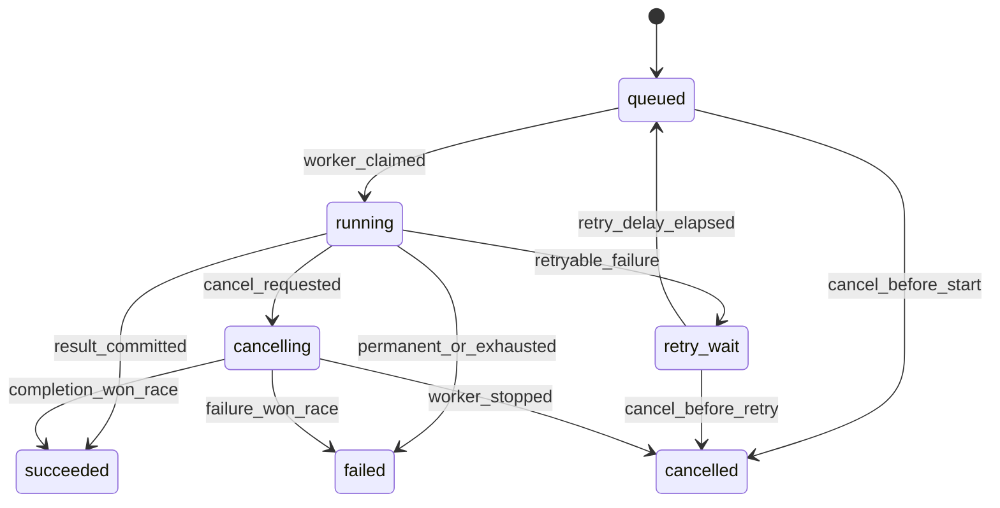
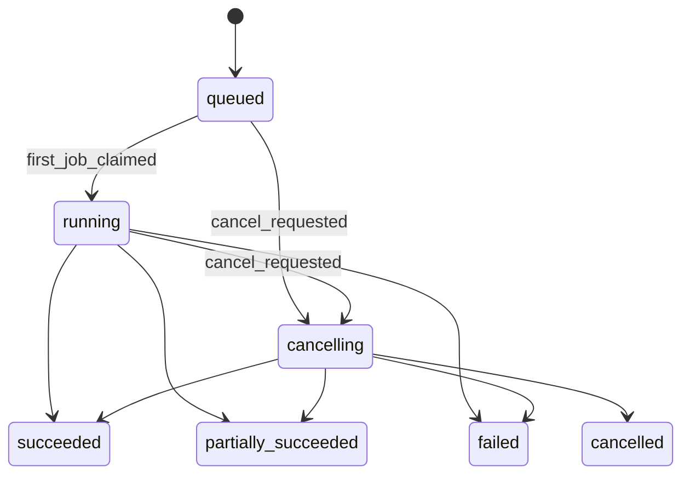

# Run 与 Job 显式状态机

## 设计目标

状态不能由各个 service 随意写字符串。所有业务转换必须先通过
`app/domain/job_state_machine.py` 或 `app/domain/run_state_machine.py`，并携带非空的
`reason` 与 `actor`。状态机负责判定是否合法；持久化层负责在同一事务写状态和
`audit_events`。

这两个职责没有合并，是因为纯状态机应当能在无数据库环境下完整单元测试，而数据库事务、
行锁和审计原子性必须由 PostgreSQL 集成测试验证。

## Job 状态图

`succeeded`、`failed`、`cancelled` 是终态。终态不能重新进入 `running`。

到期的 `retry_wait` Job 在一次领取事务中按
`retry_wait → queued → running` 两步转换，而不是增加未定义的直达边。两步均产生审计
记录。这样保留了原始状态图，又不需要一个单独的轮询进程只负责把到期重试搬回队列。

## Run 状态图

Run 的终态由后续聚合器根据 PostgreSQL 中全部 Job 的真实状态决定，不由某个 Worker
凭局部观察随意决定。Phase 3 只在首个 Job 成功领取时用条件更新完成
`queued → running`；完整聚合在后续阶段实现。

## 审计原子性

领取事务同时完成：

1. 锁定候选 Job；
2. 校验并改变 Job 状态；
3. 增加 `attempt_count` 和乐观版本；
4. 创建唯一的 `JobAttempt`；
5. 写 Job 状态审计；
6. 必要时条件更新 Run 并写 Run 状态审计；
7. 提交后才把 claim 返回给 Worker。

事务失败时这些写入整体回滚。状态机返回的上下文对象不是持久审计本身；
`audit_events` 才是数据库中的审计事实。

## 替代方案与取舍

- 数据库 ENUM：能约束值集合，却不能表达状态转换图和 reason/actor，因此仍需应用状态机。
- ORM `version_id_col`：适合普通实体更新；领取和心跳需要明确的条件
  `UPDATE ... WHERE version = expected` 与 `RETURNING`，显式 SQL更容易审计。
- 在数据库触发器中实现全部转换：原子性强，但会把规则拆到 Python 与数据库两处，降低教学
  可见性。当前用应用状态机加事务内条件写入，后续若有多个非 Python 写入方再重新评估。

## 能证明与不能证明

单元测试能证明允许边、禁止边和审计上下文规则；SQL 方言测试能证明生成语句包含预期条件。
它们不能证明真实并发调度正确。只有迁移后的真实 PostgreSQL 并发测试才覆盖行锁与
`SKIP LOCKED`，本机缺少该服务时必须报告 skip。
