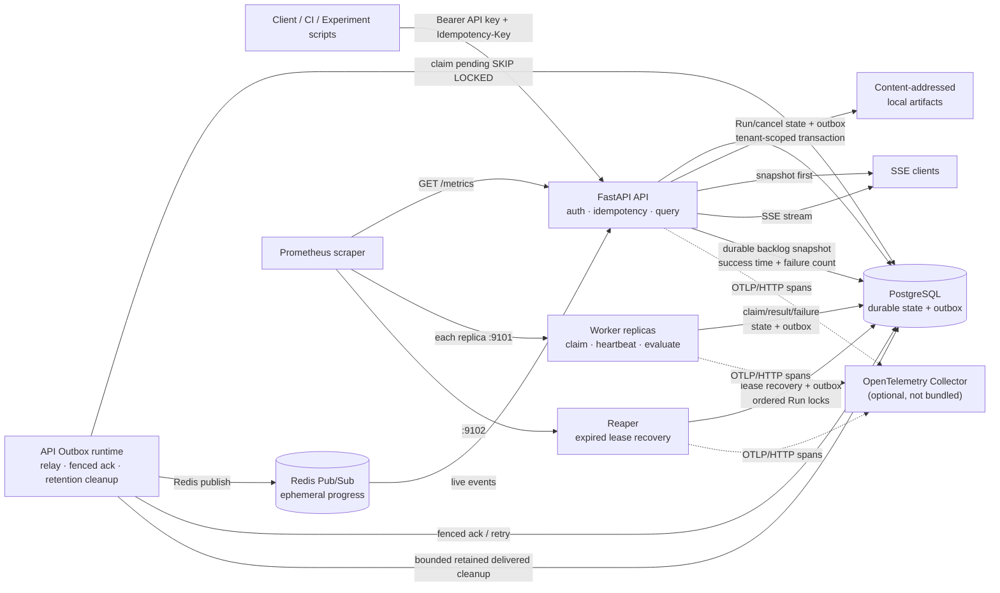
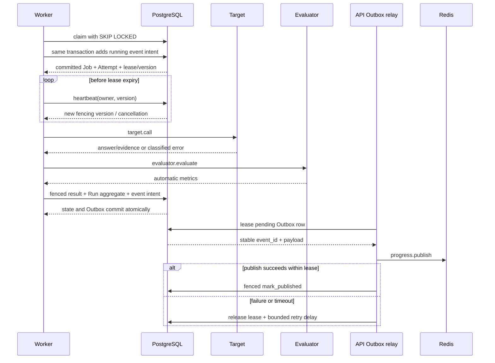
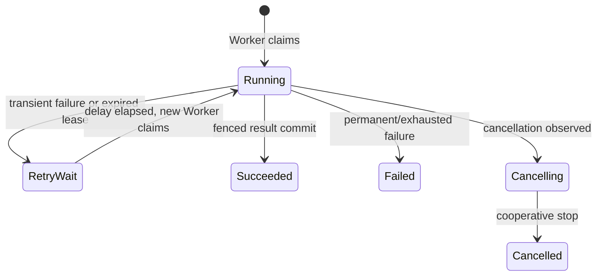

# 架构图

API、Outbox relay 与 retention cleanup 是同一 API 进程中的不同职责，不是额外 Compose 服务。
dispatcher 与 cleanup 使用独立 cadence 和 task；PostgreSQL 是最终状态和待发布意图的持久边界；
Redis 仍是可丢失的在线通知层。Prometheus 和 OpenTelemetry 不能覆盖 PostgreSQL 中的最终状态。
若 Outbox snapshot 失败，API 保留上次 backlog 值并暴露 last-success timestamp 与 failure Counter；
Prometheus 用 freshness 判断旧值，目标完全不可抓取仍由 `up` 告警负责。

## Job 生命周期

Redis 网络调用发生在短认领事务提交之后，不持有 PostgreSQL claim lock。发布失败只影响实时
通知并留下 pending row，不能回滚已提交的 CaseResult。Redis 已接受但数据库确认前崩溃时，
租约过期后会以同一 event ID 重放，所以是 at-least-once，不是 exactly-once。

独立 cleanup task 只选择超过 retention 的 `published_at IS NOT NULL` 行，按 `published_at,id`
稳定排序、限定 batch 并 `SKIP LOCKED` 删除。pending 行不参与；migration downgrade 只能移除
查询索引，不能恢复 maintenance 已经删除的 delivered intent。

## 崩溃恢复

这里是 at-least-once execution + idempotent result persistence + lease fencing，
不是 exactly-once execution。
