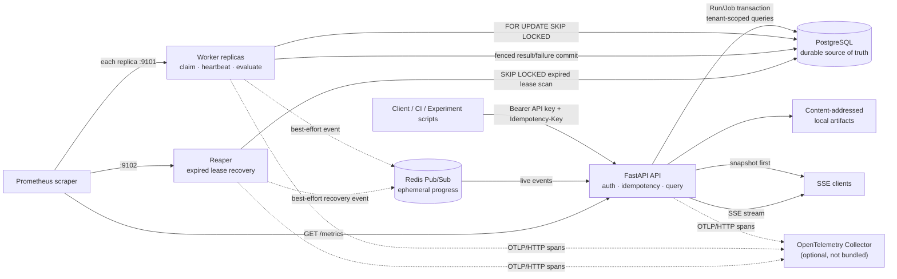
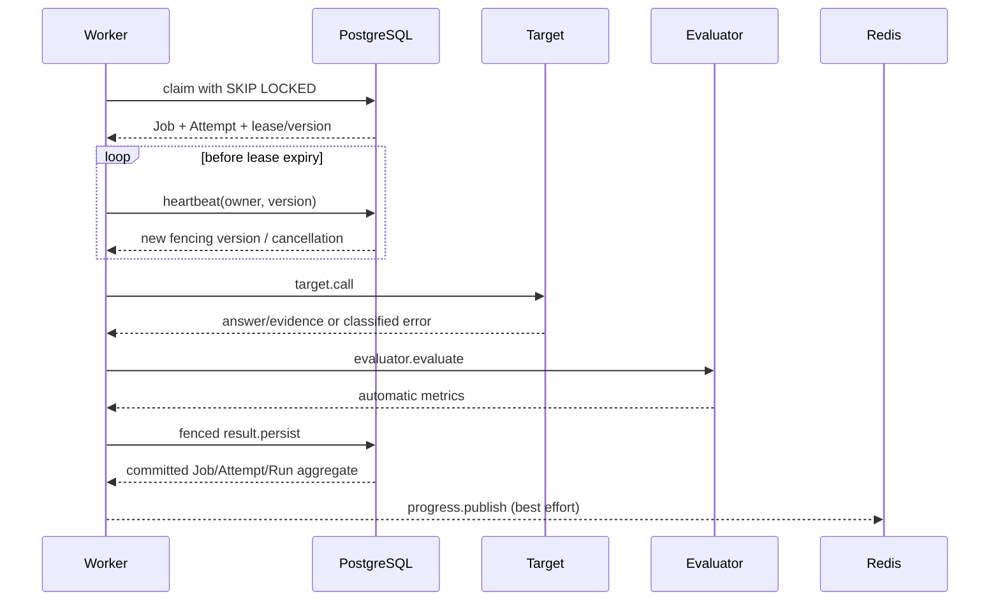
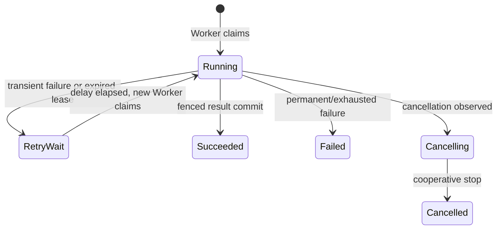

# 架构图

实线是领域正确性所需路径，虚线是可丢失或可选的观测路径。Redis、Prometheus 和
OpenTelemetry 均不能覆盖 PostgreSQL 中的最终状态。

## Job 生命周期

Redis 箭头发生在数据库提交之后。发布失败只影响实时通知，不能回滚已经提交的
CaseResult。

## 崩溃恢复

这里是 at-least-once execution + idempotent result persistence + lease fencing，
不是 exactly-once execution。
